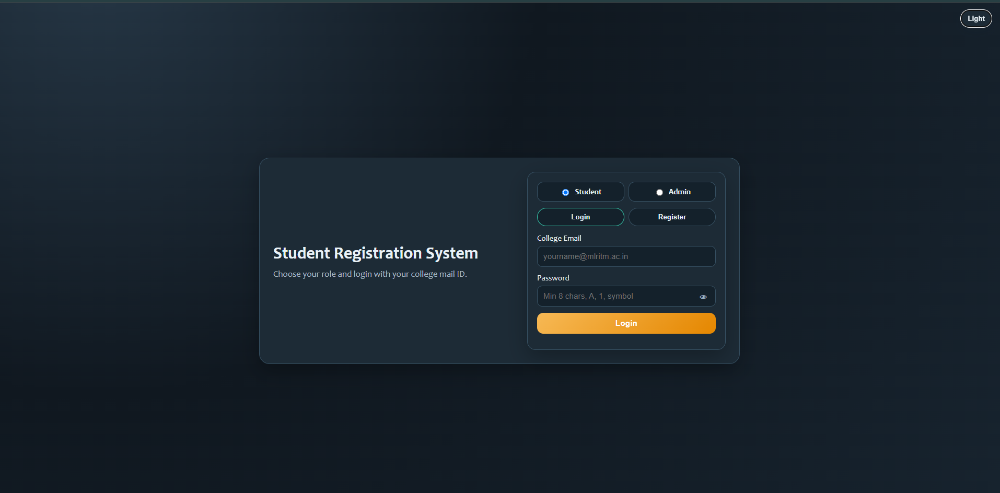
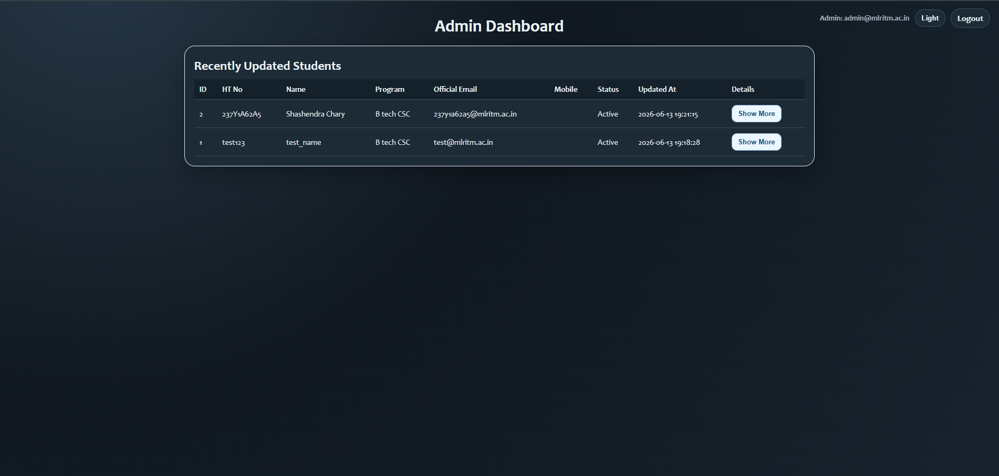
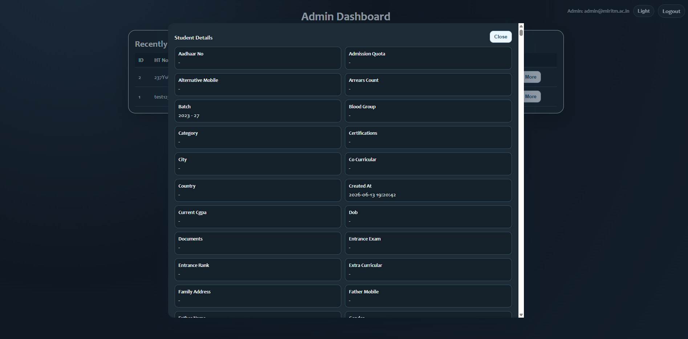
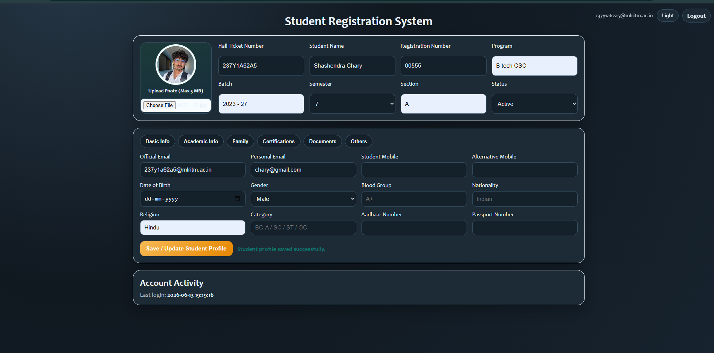

# Student Registration System

A web-based Student Registration System built using Flask, HTML, CSS, and JavaScript.

## Features

* Student Registration & Login
* Admin Login
* Student Profile Management
* Session Management
* Secure Password Hashing
* Responsive User Interface

## Tech Stack

* Python
* Flask
* HTML
* CSS
* JavaScript
* Git & GitHub
* Render

## Live Demo

https://student-registration-system-hc27.onrender.com

## Screenshots

### Login Page

### Admin Dashboard

### Admin Dashboard 2

### Student Profile

## Project Structure

* app.py
* templates/
* static/
* requirements.txt

## Deployment

Hosted on Render and connected with GitHub for continuous deployment.
